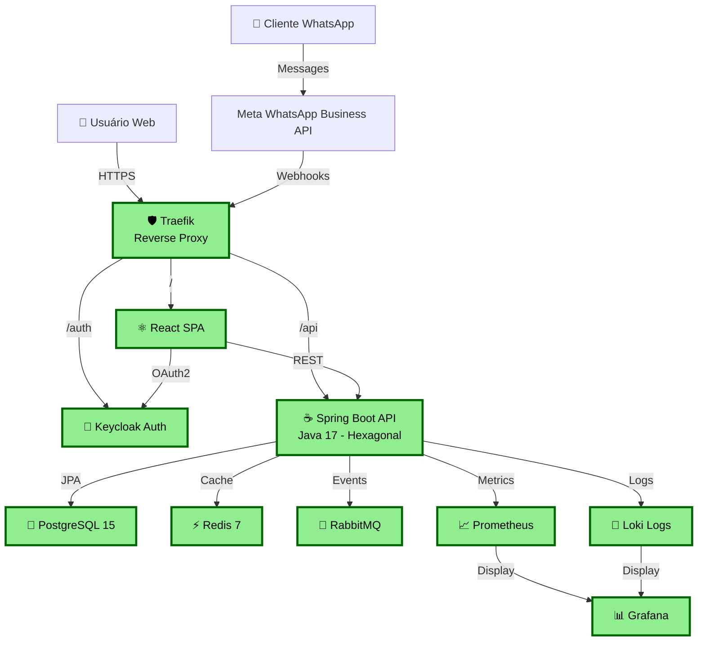
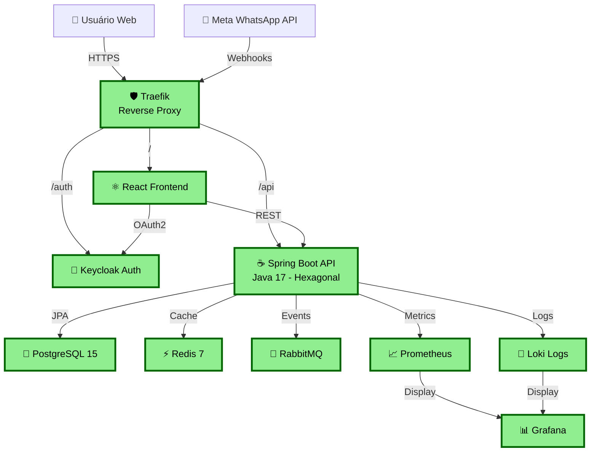
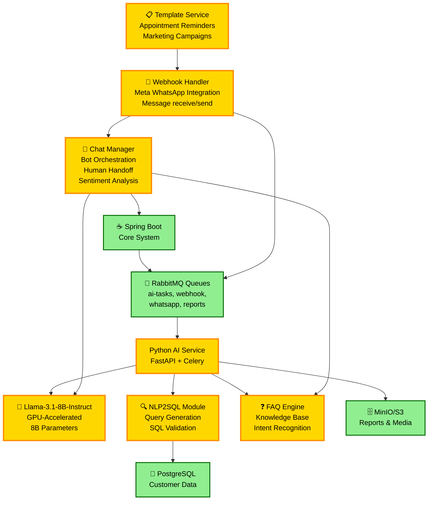
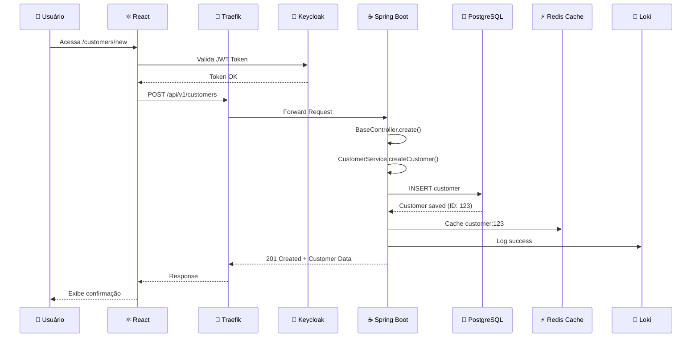
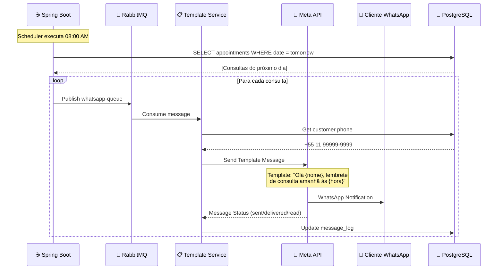
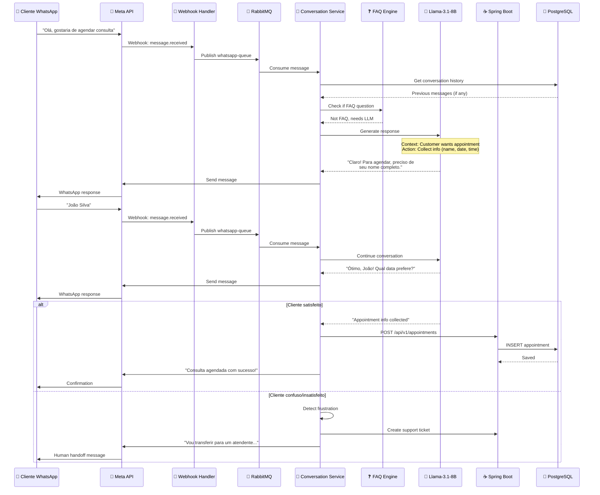
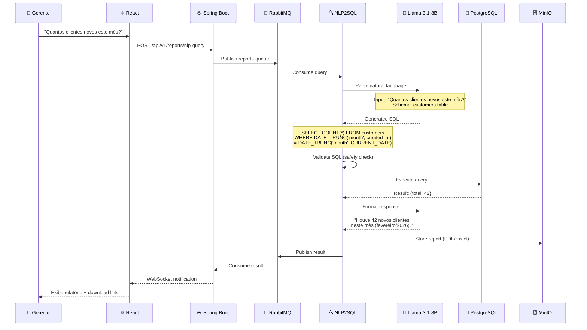
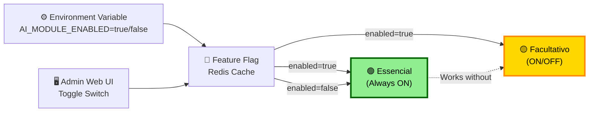
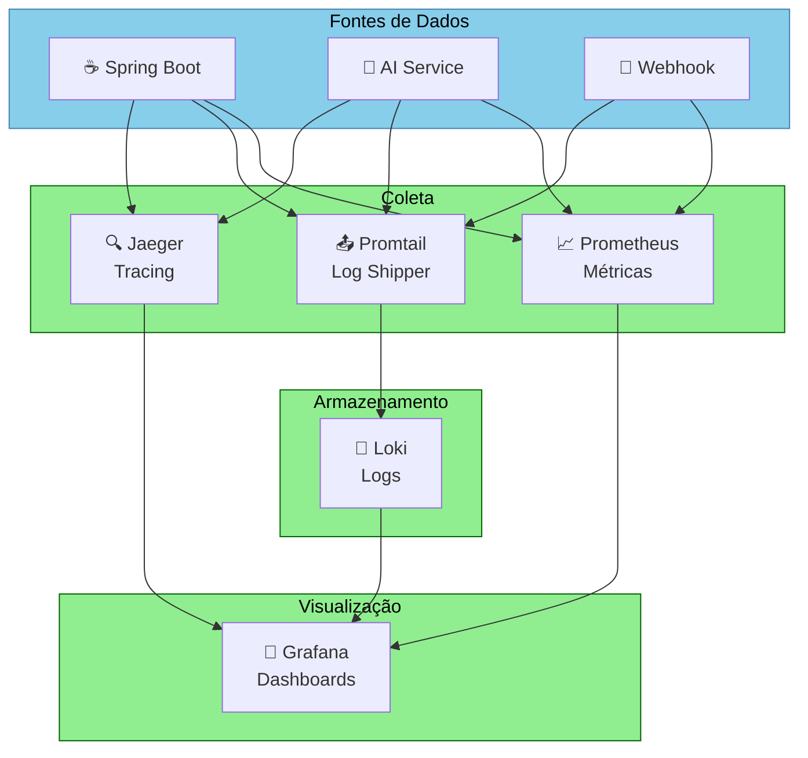

# 🏗️ ARQUITETURA COMPLETA - CRM SÃO RAFAEL

## 📋 Resumo Executivo

```
INFRAESTRUTURA:
├─ Servidor físico próprio (on-premise)
├─ Arquitetura Serverless/Lambda-like (on-demand)
├─ Volume WhatsApp: 200 msgs/mês (40 templates + 160 conversacionais)
├─ Hardware: i7, 16GB RAM, 500GB SSD (R$ 8-12k, one-time)
├─ Operacional: R$ 701/mês (25% mais barato que cloud VPS)
└─ Break-even: ~2 anos

COMPONENTES:
🟢 ESSENCIAL (24/7):     Spring Boot | PostgreSQL | Redis | RabbitMQ | Keycloak | Monitoring
🟡 FACULTATIVO (Ligável): LLM (Llama) | NLP2SQL | WhatsApp Bot | Templates
⚡ SERVERLESS:           Executam sob demanda, pagam apenas pelo tempo real
```

---

## 🎨 DIAGRAMA 1: Arquitetura Completa (Mermaid)



---

## 🟢 ESSENCIAL (Componentes Sempre Ligados 24/7)



---

## 🟡 FACULTATIVO (Pode Ser Desligado)




---

## 📊 FLUXOS PRINCIPAIS

### Fluxo 1: Cadastro de Cliente (Essencial)



---

### Fluxo 2: Lembrete de Consulta via WhatsApp (Scheduler)



**Volume:** 40 templates/mês = ~1.3/dia  
**Tempo:** ~10-30s por vez  
**Custo:** Mínimo (apenas scheduler)

---

### Fluxo 3: Chat Conversacional com LLM (On-Demand)



**Volume:** 160 msgs/mês = 5.3/dia  
**Tempo:** 5-10s por mensagem  
**Custo GPU:** 160 msgs × 7.5s ≈ 20 min/mês

---

### Fluxo 4: NLP2SQL para Relatórios (On-Demand)



**Frequência:** Sob demanda  
**Tempo:** 5-30s (primeira execução)  
**Custo GPU:** ~22 min/mês

---

## ⚙️ ATIVAÇÃO/DESATIVAÇÃO DO MÓDULO FACULTATIVO



**Configuração em tempo real via:**
- Variável ambiente (.env)
- Admin Interface (toggle switch)
- Feature Flag (Redis, sem restart)

---

## 📡 OBSERVABILIDADE COMPLETA



### Dashboards Disponíveis:
- Request Rate (req/s)
- Error Rate (%)
- Latency (p50/p99)
- LLM Inference Time
- GPU Memory Usage
- Token Count
- Database Load
- Cache Hit Rate
- Active Users
- WhatsApp msgs/day
- Relatórios gerados/day

---

## 🖥️ PRÉ-REQUISITOS DO SERVIDOR FÍSICO

### Hardware Mínimo Viável (Recomendado)

```
CPU:        Intel Core i7 / AMD Ryzen 5 (4-6 cores)
RAM:        16 GB DDR4 / DDR5
Storage:    
├─ SSD 500GB para OS + Docker
├─ HDD 2TB para PostgreSQL backups
└─ HDD 1TB para MinIO (Object Storage)

Rede:       Gigabit Ethernet (1Gbps)
Fonte:      650W (fonte com redundância)
Cooling:    Ventilação adequada (rack/armário)
UPS:        Para evitar downtime

GPU (Opcional):
├─ Opção A: RTX 3060 local (R$ 2.500) → +R$ 80-120/mês energia
├─ Opção B: GPU Cloud Share (Vast.ai) ⭐ RECOMENDADO
│  └─ 42 min/mês × R$ 0,40/h = R$ 0,30/mês
├─ Opção C: CPU only (mais lento, mas funciona)
└─ MELHOR CUSTO: Opção B

CUSTO HARDWARE: R$ 8.000 - R$ 15.000 (one-time)
```

### Software Requerido

```
Ubuntu 22.04 LTS
Docker 24.0+
Docker Compose 2.0+
Java 17 JDK
Python 3.11
Git, curl, wget, htop, iotop
```

---

## 💰 ANÁLISE DE CUSTOS DETALHADA

### Cenário A: Cloud VPS (Traditional)

| Item | Custo Unit | Frequência | Mensal |
|------|-----------|-----------|--------|
| VPS (2vCPU, 4GB) | R$ 800 | Mensal | R$ 800 |
| GPU Cloud (150h) | R$ 0,50/h | ~150h | R$ 75 |
| Backup S3 (200GB) | R$ 0,10/GB | 200GB | R$ 20 |
| Domínio | R$ 40/ano | - | R$ 3,33 |
| SMTP (5k emails) | R$ 50 | Mensal | R$ 50 |
| Meta WhatsApp API | R$ 4 | Mensal | R$ 4 |
| **TOTAL** | | | **R$ 952,33/mês** |

**Anual:** R$ 11.428/ano  
**Break-even:** Imediato  
**SLA:** 99.9%

---

### Cenário B: On-Premise Mínimo ⭐ RECOMENDADO

#### SETUP INICIAL (One-time)
- Servidor (i7, 16GB, 500GB): **R$ 8.000**
- Rack/Cabeamento/Setup: **R$ 2.000**
- **Total:** **R$ 10.000**

#### AMORTIZAÇÃO (60 meses = 5 anos)
**R$ 10.000 / 60 = R$ 166,67/mês**

#### OPERACIONAL MENSAL

| Item | Custo |
|------|-------|
| Energia (servidor 24/7) | R$ 150 |
| Internet Fibra (300Mbps) | R$ 200 |
| S3 Backup (semanal) | R$ 30 |
| Manutenção preventiva | R$ 50 |
| Domínio | R$ 50 |
| SMTP (5k emails) | R$ 50 |
| GPU Cloud Share (42min/mês) | R$ 0,30 |
| Meta WhatsApp API | R$ 4 |
| **OPERACIONAL TOTAL** | **R$ 534,30** |

#### CUSTO MENSAL TOTAL
- Amortização: **R$ 167**
- Operacional: **R$ 534,30**
- **TOTAL: R$ 701,30/mês**

#### CUSTO ANUAL
- **Ano 1:** R$ 8.416 (inclui inicial)
- **Anos 2-5:** R$ 8.416/ano
- **Média 5 anos:** R$ 8.435/ano
- **Break-even:** ~2 anos
- **Economia vs Cloud:** R$ 251/mês = R$ 3.012/ano (26%)

---

### Cenário C: On-Premise Enterprise (Não recomendado para 200 msgs)

```
Setup:        R$ 48.000
Operacional:  R$ 1.500/mês
Ano 1 Total:  R$ 26.400
Total 5 anos: R$ 117.000

⚠️ ACIMA do cloud
✅ Justificado apenas se: SLA crítico + crescimento 10x
```

---

## 📊 TABELA COMPARATIVA (5 ANOS)

| Cenário | Ano 1 | Anos 2-5 | Total 5 Anos | Break-even |
|---------|-------|----------|--------------|-----------|
| **Cloud VPS** | R$ 11.428 | R$ 11.428/ano | **R$ 56.568** | Imediato |
| **On-Premise Mínimo** ⭐ | R$ 8.416 | R$ 8.416/ano | **R$ 41.680** | ~2 anos |
| **Economia** | -R$ 3.012 | R$ 3.012/ano | **+R$ 14.888 (26%)** | 18-24 meses |

---

## 🎯 RECOMENDAÇÃO FINAL: CENÁRIO B

```
✅ SETUP RECOMENDADO

INVESTIMENTO INICIAL: R$ 10.000
OPERACIONAL: R$ 701,30/mês
ANUAL: R$ 8.416

VANTAGENS:
• 26% economia no 1º ano
• 38% economia nos anos seguintes
• Escalável (adicione servidores)
• Custódia total dos dados
• Sem vendor lock-in
• Ambiente controlado

DESAFIOS:
• Requer manutenção manual
• Sem redundância automática
• Uptime depende do usuário
• Precisa knowledge Linux

ESCALABILIDADE:
├─ Ano 1: Setup mínimo (R$ 701/mês)
├─ Ano 2: +Backup server (R$ 1.100/mês)
├─ Ano 3: +Colocation (R$ 1.400-1.800/mês)
└─ Ano 5: Multi-region (R$ 2.500+/mês)
```

---

## 📌 RESUMO FINAL

```

ECONOMIA EM LONGO PRAZO (5 ANOS):
└─ R$ 14.888 mais barato que cloud VPS (26% economia)

SERVIDOR RECOMENDADO:
├─ i7 / 16GB RAM / 500GB SSD
├─ Investimento: R$ 10.000
├─ Operacional: R$ 701,30/mês
└─ Break-even: 2 anos

```

---

**Documento Consolidado e Completo**  
**Data:** 09 de Fevereiro de 2026  
**Versão:** 2.0 - Final com Merrmaids + Custos Otimizados + Meta API
