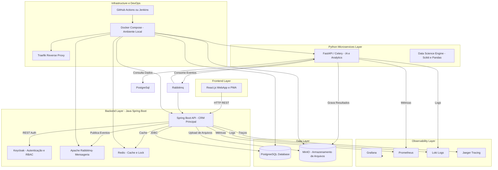

```mermaid
flowchart TB
    %% =======================
    %% Camadas principais
    %% =======================
    subgraph FRONTEND[Frontend Layer]
        REACT[React.js WebApp e PWA]
    end

    subgraph BACKEND[Backend Layer - Java Spring Boot]
        API[Spring Boot API - CRM Principal]
        SECURITY[Keycloak - Autenticação e RBAC]
        KAFKA[Apache Rabbitmq- Mensageria]
        REDIS[Redis - Cache e Lock]
    end

    subgraph DATA[Data Layer]
        PostgreeSQL[(PostgreeSQL Database)]
        MINIO[(MinIO - Armazenamento de Arquivos)]
    end

    subgraph PY_MICROSERVICES[Python Microservices Layer]
        PYAI[FastAPI / Celery - IA e Analytics]
        DS[Data Science Engine - Scikit e Pandas]
    end

    subgraph OBS[Observability Layer]
        GRAFANA[Grafana]
        PROMETHEUS[Prometheus]
        LOKI[Loki Logs]
        JAEGER[Jaeger Tracing]
    end

    subgraph INFRA[Infrastructure e DevOps]
        DOCKER[Docker Compose - Ambiente Local]
        TRAEFIK[Traefik Reverse Proxy]
        GIT[GitHub Actions ou Jenkins]
    end

    %% =======================
    %% Fluxos principais
    %% =======================
    REACT -->|HTTP REST| API
    API -->|JDBC| PostgreeSQL
    API -->|REST Auth| SECURITY
    API -->|Publica Eventos| KAFKA
    API -->|Cache| REDIS
    API -->|Upload de Arquivos| MINIO

    PYAI -->|Consome Eventos| Rabbitmq
    PYAI -->|Consulta Dados| PostgreSql
    PYAI -->|Grava Resultados| MINIO

    Rabbitmq--> API
    Rabbitmq--> PYAI

    API -->|Métricas| PROMETHEUS
    API -->|Logs| LOKI
    API -->|Traços| JAEGER
    PYAI -->|Métricas| PROMETHEUS
    PYAI -->|Logs| LOKI
    OBS --> GRAFANA

    DOCKER --> API
    DOCKER --> PYAI
    DOCKER --> PostgreeSQL
    DOCKER --> KAFKA
    DOCKER --> REDIS
    DOCKER --> MINIO
    DOCKER --> TRAEFIK
    GIT --> DOCKER

```
