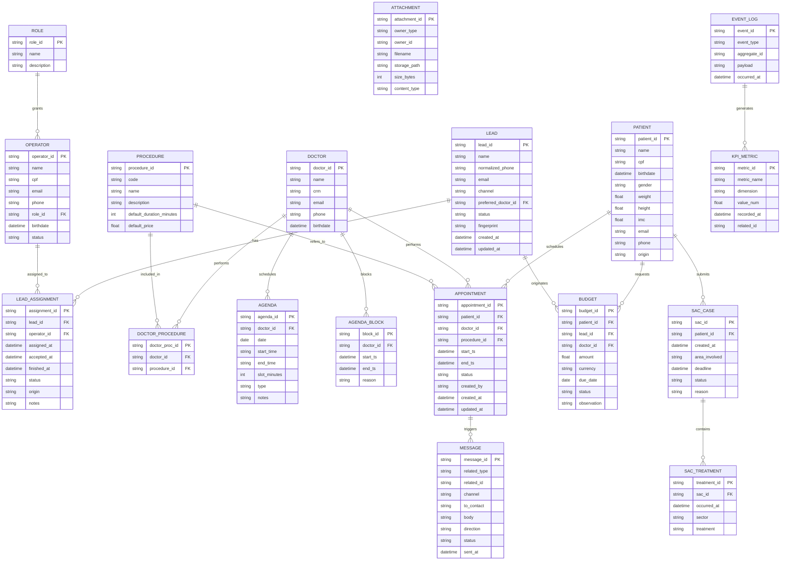

# HospitalSaoRafael
Documentacao
Banco de dados:

```mermaid
erDiagram
  LEAD {
    string lead_id PK
    string name
    string normalized_phone
    string email
    string channel
    string preferred_doctor_id FK
    string status
    string fingerprint
    datetime created_at
    datetime updated_at
  }

  LEAD_ASSIGNMENT {
    string assignment_id PK
    string lead_id FK
    string operator_id FK
    datetime assigned_at
    datetime accepted_at
    datetime finished_at
    string status
    string origin
    string notes
  }

  OPERATOR {
    string operator_id PK
    string name
    string cpf
    string email
    string phone
    string role_id FK
    datetime birthdate
    string status
  }

  ROLE {
    string role_id PK
    string name
    string description
  }

  DOCTOR {
    string doctor_id PK
    string name
    string crm
    string email
    string phone
    datetime birthdate
  }

  DOCTOR_PROCEDURE {
    string doctor_proc_id PK
    string doctor_id FK
    string procedure_id FK
  }

  PATIENT {
    string patient_id PK
    string name
    string cpf
    datetime birthdate
    string gender
    float weight
    float height
    float imc
    string email
    string phone
    string origin
  }

  PROCEDURE {
    string procedure_id PK
    string code
    string name
    string description
    int default_duration_minutes
    float default_price
  }

  AGENDA {
    string agenda_id PK
    string doctor_id FK
    date date
    string start_time
    string end_time
    int slot_minutes
    string type
    string notes
  }

  AGENDA_BLOCK {
    string block_id PK
    string doctor_id FK
    datetime start_ts
    datetime end_ts
    string reason
  }

  APPOINTMENT {
    string appointment_id PK
    string patient_id FK
    string doctor_id FK
    string procedure_id FK
    datetime start_ts
    datetime end_ts
    string status
    string created_by
    datetime created_at
    datetime updated_at
  }

  BUDGET {
    string budget_id PK
    string patient_id FK
    string lead_id FK
    string doctor_id FK
    float amount
    string currency
    date due_date
    string status
    string observation
  }

  SAC_CASE {
    string sac_id PK
    string patient_id FK
    datetime created_at
    string area_involved
    datetime deadline
    string status
    string reason
  }

  SAC_TREATMENT {
    string treatment_id PK
    string sac_id FK
    datetime occurred_at
    string sector
    string treatment
  }

  MESSAGE {
    string message_id PK
    string related_type
    string related_id
    string channel
    string to_contact
    string body
    string direction
    string status
    datetime sent_at
  }

  ATTACHMENT {
    string attachment_id PK
    string owner_type
    string owner_id
    string filename
    string storage_path
    int size_bytes
    string content_type
  }

  EVENT_LOG {
    string event_id PK
    string event_type
    string aggregate_id
    string payload
    datetime occurred_at
  }

  KPI_METRIC {
    string metric_id PK
    string metric_name
    string dimension
    float value_num
    datetime recorded_at
    string related_id
  }

  %% RELAÇÕES
  LEAD ||--o{ LEAD_ASSIGNMENT : has
  OPERATOR ||--o{ LEAD_ASSIGNMENT : assigned_to
  ROLE ||--o{ OPERATOR : grants
  DOCTOR ||--o{ DOCTOR_PROCEDURE : performs
  PROCEDURE ||--o{ DOCTOR_PROCEDURE : included_in
  DOCTOR ||--o{ AGENDA : schedules
  DOCTOR ||--o{ AGENDA_BLOCK : blocks
  PATIENT ||--o{ APPOINTMENT : schedules
  DOCTOR ||--o{ APPOINTMENT : performs
  PROCEDURE ||--o{ APPOINTMENT : refers_to
  PATIENT ||--o{ BUDGET : requests
  LEAD ||--o{ BUDGET : originates
  PATIENT ||--o{ SAC_CASE : submits
  SAC_CASE ||--o{ SAC_TREATMENT : contains
  APPOINTMENT ||--o{ MESSAGE : triggers
  EVENT_LOG ||--o{ KPI_METRIC : generates

```
